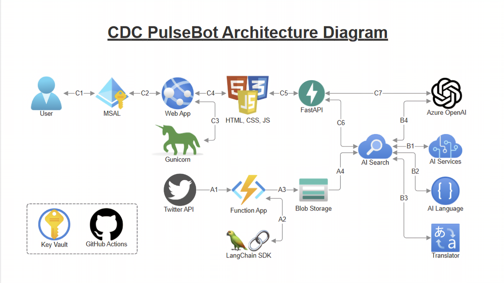

# CDC PulseBot
Real-time tweet monitoring and AI-powered analysis platform for surfacing public trends, sentiment, and emerging issues related to the CDC.

## Key Use Cases

- **Public Signal Monitoring at Scale**  
  Continuously collects and analyzes tweets referencing the CDC to surface emerging issues, sentiment shifts, and population-level reactions tied to ongoing initiatives.

- **Operational Awareness During High-Visibility Events**  
  Provides real-time metrics—tweet volume, sentiment scores, language distribution, and named entities—filtered by custom date ranges to track response to major events or announcements.

- **Insight Without Overhead**  
  Features a natural language chat interface powered by Retrieval-Augmented Generation (RAG) that allows users to extract insights without writing queries or performing manual analysis.

- **Equity and Reach Assessment**  
  Detects language and geographic variation to highlight which communities are engaging with CDC-related topics—supporting more informed, inclusive approaches to intervention planning.

- **Execution Demonstration**  
  The application is self-contained, cloud-deployable, and built to operate securely—showing how intelligent, modular tools can be developed and run within mission constraints.
 

## Pipelines

### A - Tweet Ingestion and Indexing
### B - AI Enrichment and Vector Embedding
### C - Dashboard and Chat App Workflow
